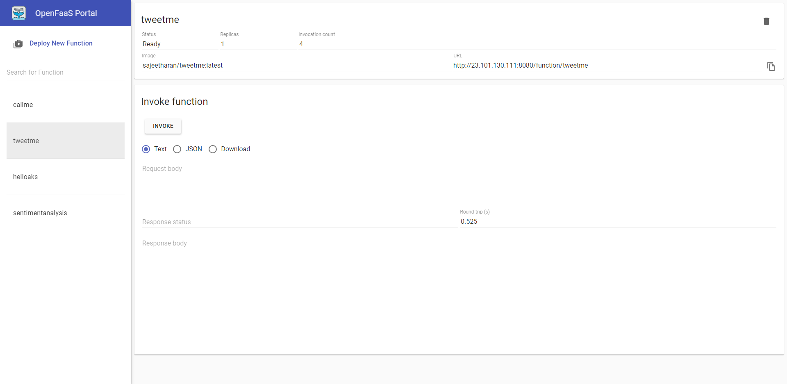

# TweetMe - OpenFaaS function with AKS

## Description

This is an OpenFaaS function written in Python that makes use of the `tweepy` library to send a tweet from your Twitter account.



# Prerequisites
Follow the guideliness given in https://github.com/sajeetharan/serverless-with-openfaas-aks-workshop-colombo to setup the OpenFaas  on AKS.


Slides : https://slides.com/sajeetharansinnathurai/openfaas

## Set up

1. You will need to specify your Twitter app environment variables in the `tweetme.yml` file.

```environment:
  consumer_key: ""
  consumer_secret: ""
  access_token: ""
  access_token_secret: ""
  ```

If you do not have a Twitter App you can create one [here](https://apps.twitter.com).

2. In the same file, you must set the gateway IP which should be your OpenFaas address.

` gateway: http://<OPENFAAS_IP_ADDR>:8080`

## Build,Upload and Deploy the function to a remote registry

`faas-cli up -f tweetme.yml`

 Note: The above can be done in separate steps as given in the OpenFaas documentation


